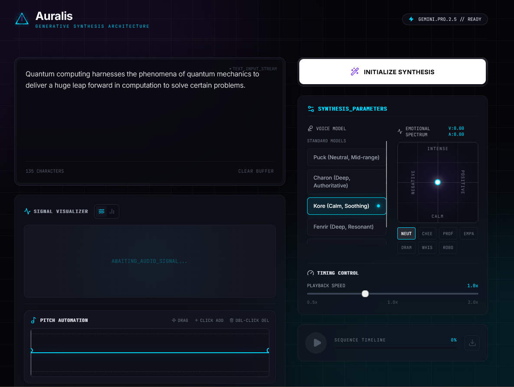

# Auralis | Generative Audio Synthesis

**Auralis** is a next-generation voice synthesizer and audio workstation powered by Google's **Gemini 2.5 Flash** model. It features advanced emotional sculpting, pitch automation, and a high-fidelity real-time spectral visualizer.


> *Note: Please add a `screenshot.png` to the root directory to see the preview above.*

## ✨ Key Features

*   **Neural TTS Engine**: Generates ultra-realistic speech using Gemini 2.5 Flash Native Audio.
*   **Emotional Sculpting**: An X-Y pad allowing you to blend Valence (Positivity) and Arousal (Energy) to create unique vocal performances.
*   **Real-time Visualization**: 
    *   **Frequency Mode**: Detailed spectral analysis with a secondary ghost waveform overlay.
    *   **Waveform Mode**: High-contrast time-domain oscilloscopic view.
*   **Pitch Automation**: Draw custom pitch curves to modulate the speech intonation post-generation.
*   **Variable Speed**: Real-time time-stretching without pitch artifacts (unless automated).
*   **WAV Export**: Download your processed audio sequences as high-quality WAV files.

## 🛠️ Tech Stack

*   **Framework**: [React 19](https://react.dev/)
*   **AI Model**: [Google GenAI SDK](https://www.npmjs.com/package/@google/genai) (Gemini 2.5 Flash)
*   **Audio Engine**: Web Audio API (AudioContext, AnalyserNode, OfflineAudioContext)
*   **Styling**: Tailwind CSS with custom glass-morphism effects.
*   **Icons**: Lucide React

## 🚀 Getting Started

### Prerequisites

*   Node.js (v18 or higher)
*   A Google Cloud Project with the Gemini API enabled.
*   An API Key.

### Installation

1.  **Clone the repository**
    ```bash
    git clone https://github.com/your-username/auralis.git
    cd auralis
    ```

2.  **Install dependencies**
    ```bash
    npm install
    ```

3.  **Configure Environment**
    Create a `.env` file in the root directory and add your API key:
    ```env
    API_KEY=your_google_gemini_api_key_here
    ```

4.  **Run the application**
    ```bash
    npm start
    ```

## 🎛️ Usage Guide

1.  **Input Text**: Type your desired speech into the text stream buffer.
2.  **Select Voice**: Choose from the available neural voice presets (Kore, Fenrir, etc.).
3.  **Adjust Emotion**: Drag the puck on the Emotional Spectrum pad to define the tone (e.g., Intense/Positive).
4.  **Synthesize**: Click "Initialize Synthesis" to generate the audio.
5.  **Visualize**: Toggle between Waveform and Frequency modes using the icons in the visualizer header.
6.  **Automate**: Click and drag on the Pitch Editor to create custom intonation curves.
7.  **Export**: Click the download icon to save the result.

## 📄 License

This project is open-source and available under the [MIT License](LICENSE).
